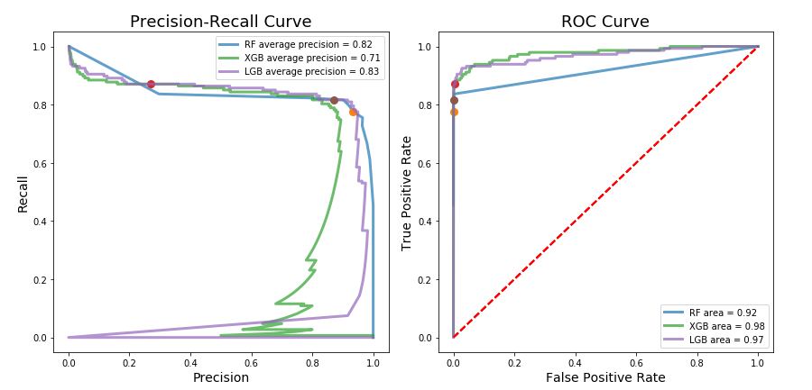

# Portfolio for:
## - Computer Vision
## - Machine Learning (Baging, Boosting, Convolutional Neural Network)
## - Web Scraping (Selenium)
## - Web Application (Django)

# Computer Vision

---

### 1. Lane detection for Self-driving cars without Deep Learning 
[Link to github repository of the project](https://github.com/orkhan-amrullayev/lane_detection_without_deep_learning/)
 
#### Using OpenCV (cv2) library, lanes are detected correctly, even the car does not follow the exact path inside the lane and slides right or left as it moves.
Read the Readme.md to customize the code for your own videos.

 
 

 
 
 

# Machine Learning

---
### 1. Fraud detection in bank transactions / Binary classification
[Link to github repository of the project](https://github.com/orkhan-amrullayev/fraud_detection_bank_transactions/)
 
#### Different models predict fraudulent bank transactions.
As per description of the dataset, it contains transactions made by credit cards in September 2013 by European cardholders. This dataset presents transactions that occurred in two days, where we have 492 frauds out of 284,807 transactions. The dataset is highly unbalanced, the positive class (frauds) account for 0.172% of all transactions.
This notebook will compare various data balancing techniques with powerful boosting models. Models used here are Random Forest, XGBoost and LGB. We will look at precision-recall curve and roc curve.

 
 

 
 

### 2. Airline service satisfaction /  Part3 Modelling. Classification
[Link to github repository of the project](https://github.com/orkhan-amrullayev/ML1_algos/blob/main/3_modelling.ipynb)
 
#### Different models predict satisfaction level of customers based on their data
Models used here are Logistic Regression, Decision Trees, Random Forest, AdaBoost. We will look at precision-recall curve and roc curve.

 

 
 

### 3. Time Series Regression with Random Forest / Hyperparameters
[Link to github repository of the project](https://github.com/orkhan-amrullayev/TimeSeries_bulldozer_sales)
 
#### Random forest regressor models predict the sales price of bulldozers according to the date and other independent variables
Error metrics: root mean square log error.
End-to-end project with data cleaning and pre-processing, feature engineering, randomizedsearch and gridsearch cross validation.

 
 

### 4. Flowers Image Clustering
[Link to github repository of the project](https://github.com/orkhan-amrullayev/Image_Clustering_Flowers)
 
#### Using Keras, VGG16 convolutional neural network clustering, hundreds of different kinds of flower images are clustered into 10 groups by their visual features. 

 

---

 
 

## Web Scraping (Selenium)

---

### 1. Flight Booking Automation with Selenium using Python
[Link to github repository of the project](https://github.com/orkhan-amrullayev/all_web_scraping_python_selenium/tree/main/flight_booking)
 
#### Web Scraping & Automation for Flight Booking.

 

---

 
 

## Web Application (Full-stack, API)

---

### 1. COVID-19 Web Application
[Link to github repository of the project](https://github.com/orkhan-amrullayev/covid19) 
 
#### Full-stack web application using Django, Rapid API and embed interactive COVID-19 visualization from John Hopkins University (Our World in Data).

 

 
 

### 2. Hotel Chain Management System
[Link to github repository of the project](https://github.com/orkhan-amrullayev/hotels_chain_management/)
 
#### Milton - Django Full-Stack Web App for a hotels chain. Used Python, SQLite, HTML, CSS. Accessible for both users and managers.

 

